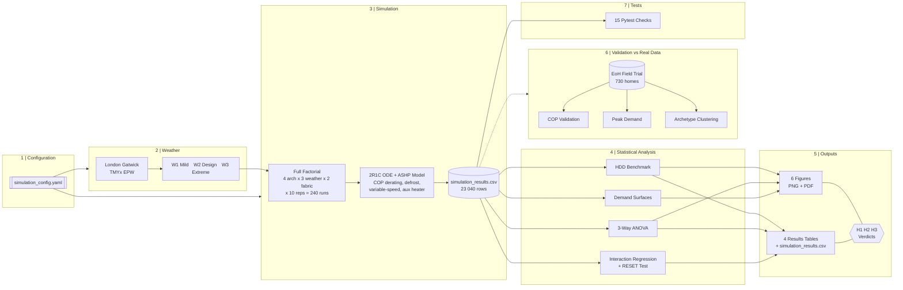
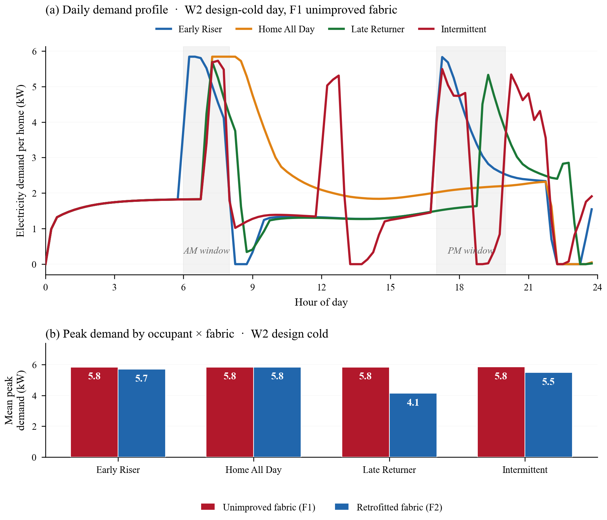
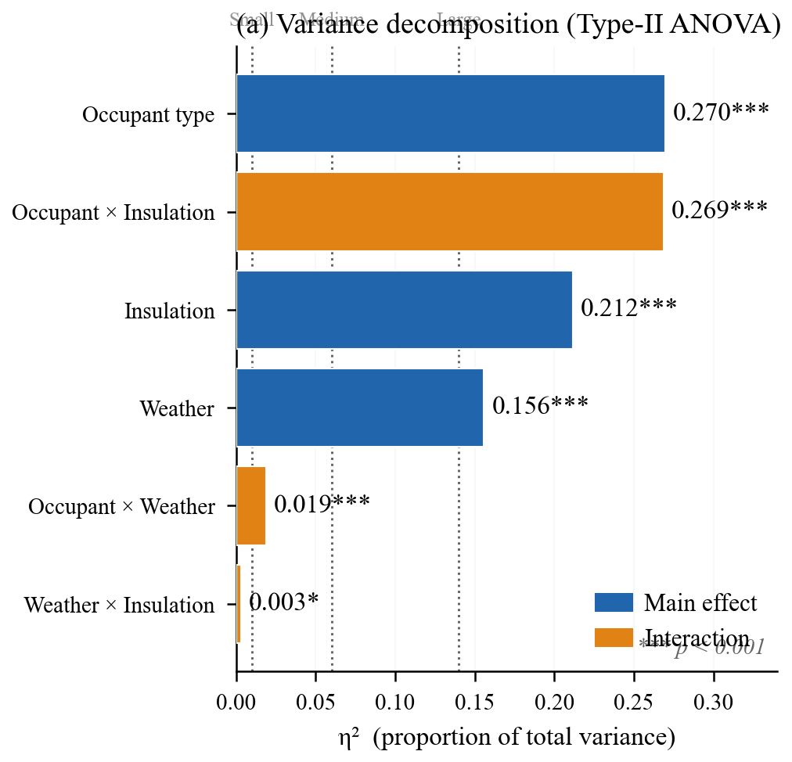
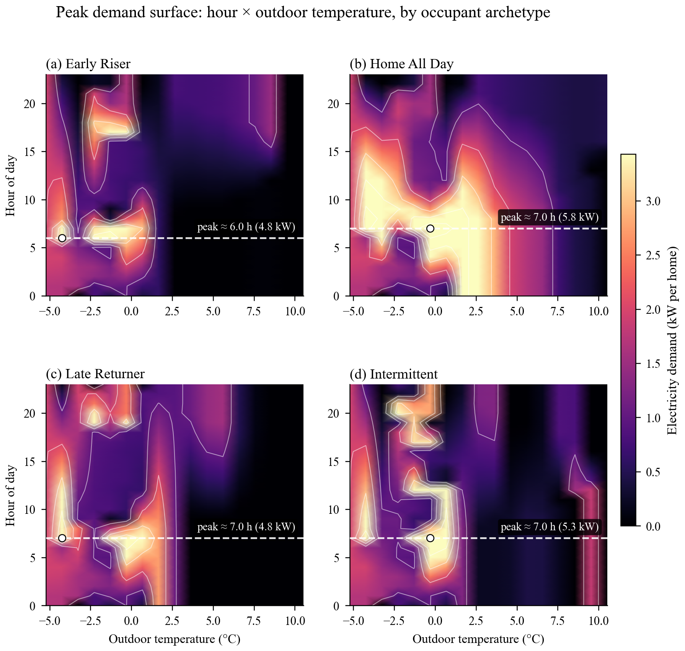
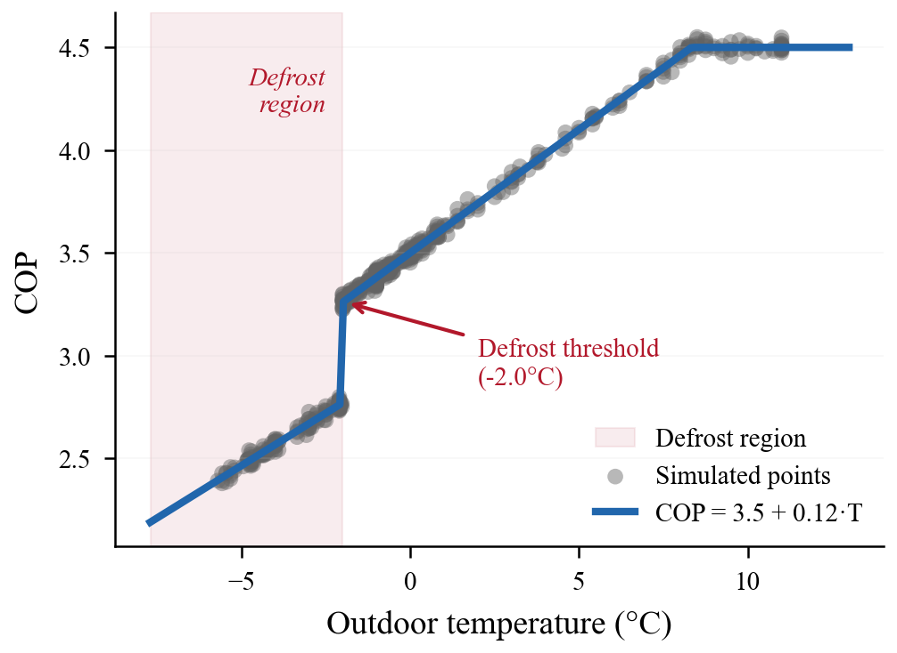
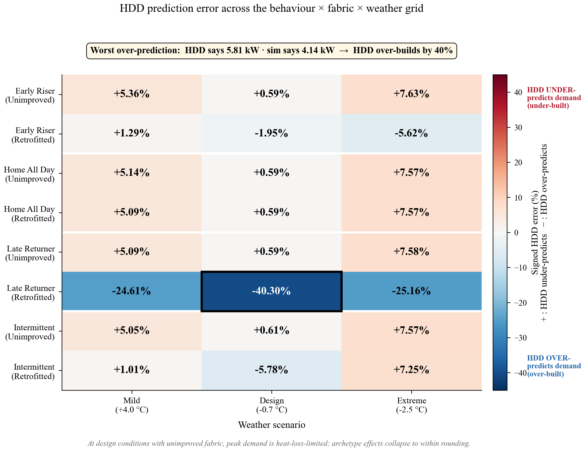
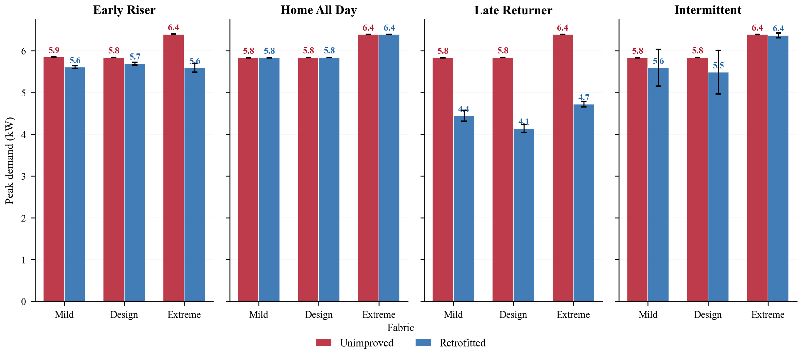

# How Much Does Ignoring Occupant Behaviour Cost?

### Quantifying the Underestimation of Heat Pump Peak Demand in Current Grid Planning Tools

A research pipeline that simulates UK domestic heat pump electricity demand under varying occupant behaviour, building fabric, and weather conditions, and quantifies how much a Heating-Degree-Day (HDD) planning model — the industry standard — misses when it ignores occupant diversity and the nonlinear weather-behaviour interaction.

---

## Table of Contents

1. [Research Question and Hypotheses](#1-research-question-and-hypotheses)
2. [Project Structure](#2-project-structure)
3. [How to Run](#3-how-to-run)
4. [The Model](#4-the-model)
5. [Analytical Methods](#5-analytical-methods)
6. [Data Sources](#6-data-sources)
7. [Validation Against Real Data](#7-validation-against-real-data)
8. [Figures and Outputs](#8-figures-and-outputs)
9. [Test Suite](#9-test-suite)
10. [Results Summary](#10-results-summary)
11. [Dependencies](#11-dependencies)

---

## 1. Research Question and Hypotheses

**Central question:** Do current grid planning tools (HDD-based regression) systematically underestimate heat pump peak electricity demand because they ignore occupant behaviour diversity?

Three formal hypotheses are tested:

| ID | Hypothesis | Statistical Test |
|----|-----------|-----------------|
| **H1** | HDD underestimation of peak demand increases at lower outdoor temperatures | Monotonic increase in worst-case archetype error across W1 -> W2 -> W3 |
| **H2** | Occupant behaviour is a stronger predictor of peak demand than building fabric quality | ANOVA eta-squared: archetype > fabric |
| **H3** | The weather-behaviour interaction is nonlinear, making HDD-linear models structurally inadequate | Ramsey RESET test (p < 0.05) on HDD-linear model residuals |

Verdicts and the numbers behind them are in [Section 10](#10-results-summary). H2 and H3 are supported; H1 is not.

---

## Pipeline Overview


```mermaid
flowchart LR
    subgraph CONFIG["1 | Configuration"]
        CFG[["simulation_config.yaml"]]
    end

    subgraph WEATHER["2 | Weather"]
        EPW["London Gatwick<br/>TMYx EPW"] --> W["W1 Mild &ensp; W2 Design &ensp; W3 Extreme"]
    end

    subgraph SIM["3 | Simulation"]
        direction TB
        FAC["Full Factorial<br/>4 arch x 3 weather x 2 fabric<br/>x 10 reps = 240 runs"]
        ODE["2R1C ODE + ASHP Model<br/>COP derating, defrost,<br/>variable-speed, aux heater"]
        OUT[("simulation_results.csv<br/>23 040 rows")]
        FAC --> ODE --> OUT
    end

    subgraph ANALYSIS["4 | Statistical Analysis"]
        direction TB
        HDD["HDD Benchmark"]
        ANV["3-Way ANOVA"]
        REG["Interaction Regression<br/>+ RESET Test"]
        SURF["Demand Surfaces"]
    end

    subgraph OUTPUTS["5 | Outputs"]
        direction TB
        FIG["6 Figures<br/>PNG + PDF"]
        TAB["4 Results Tables<br/>+ simulation_results.csv"]
        VER{{"H1 H2 H3<br/>Verdicts"}}
        FIG --- VER
        TAB --- VER
    end

    subgraph VALID["6 | Validation vs Real Data"]
        direction TB
        EOH[("EoH Field Trial<br/>730 homes")]
        COP["COP Validation"]
        PK["Peak Demand"]
        ARC["Archetype Clustering"]
        EOH --> COP
        EOH --> PK
        EOH --> ARC
    end

    subgraph TEST["7 | Tests"]
        PYT["15 Pytest Checks"]
    end

    CFG --> WEATHER
    CFG --> SIM
    W --> FAC
    OUT --> HDD
    OUT --> ANV
    OUT --> REG
    OUT --> SURF
    HDD --> TAB
    ANV --> TAB
    REG --> TAB
    HDD --> FIG
    ANV --> FIG
    SURF --> FIG
    OUT --> PYT
    OUT -.-> VALID
```

---

## 2. Project Structure

```
heat-pump-peak-demand-modelling/
|
|-- main.py                          # Orchestrator -- runs the whole pipeline
|-- simulation.py                    # EPW parser + 2R1C thermal / heat pump engine
|-- pipeline.py                      # HDD benchmark, ANOVA, regression, demand surfaces, ADMD, cost
|-- validation.py                    # EoH field-trial validation (COP, peaks, archetype clustering)
|-- plots.py                         # Figure style + figure functions (main.py produces fig1-fig6)
|-- tests.py                         # Pytest suite (15 tests)
|-- requirements.txt
|-- .gitignore
|
|-- config/
|   +-- simulation_config.yaml      # Every parameter, with inline source citations
|
|-- notebooks/
|   +-- model_review.ipynb          # Interactive walkthrough of the model and results
|
|-- data/
|   |-- raw/                        # EPW file + the three extracted weather CSVs
|   |-- processed/                  # simulation_results.csv (23,040 rows)
|   +-- external/                   # EoH, EPC, ENWL, SERL (download separately; not in repo)
|
+-- outputs/
    |-- figures/                    # fig1-fig6, PNG + PDF
    +-- tables/                     # Pipeline, ADMD/cost and validation CSVs + validation_summary.json
```

---

## 3. How to Run

### Prerequisites

```bash
# Python 3.10+ required
pip install -r requirements.txt
```

### Full pipeline (single command)

```bash
python main.py           # ~11 s end to end when measured here, about half of it the inline test run
python main.py --debug   # same but with DEBUG-level logging
```

This produces:
- 4 CSV tables in `outputs/tables/` (`hdd_benchmark`, `anova_results`, `model_comparison`, `master_results`), plus `data/processed/simulation_results.csv`
- 12 figure files (6 figures, PNG + PDF) in `outputs/figures/`
- The 15-test pytest suite, run inline
- Printed hypothesis verdicts

### Interactive notebook

```bash
jupyter notebook notebooks/model_review.ipynb
```

Walks through every stage with inline plots. It also writes the ADMD and cost-of-underestimation tables listed in [Section 8.2](#82-results-tables), which `main.py` does not produce.

### Validation against the EoH field trial (requires a data download)

```bash
# 1. Download the EoH 30-min interval dataset (SN 9209) from the UK Data Service
# 2. Place it in data/external/eoh/UKDA-30min-Interval-9209-csv/csv/
# 3. Run:
python validation.py
```

The validation tables in `outputs/tables/` were produced this way and are committed, so the results in [Section 7](#7-validation-against-real-data) can be read without the download.

### Run tests only

```bash
python -m pytest tests.py -v
```

---

## 4. The Model

### The building

A **2R1C lumped-capacitance thermal model** (`simulation.py`) — one indoor air node with thermal capacitance `C`, one overall heat-loss coefficient `UA`:

```
C * dT_in/dt = Q_hp + Q_internal + Q_solar - UA * (T_in - T_out)
UA = Sum(U_i * A_i) + 0.33 * ACH * Volume        [W/K]
```

Integrated by forward Euler at 60-second internal steps, recorded every 15 minutes (96 points per day). The reference dwelling is a 1970s UK semi-detached house: 85 m2 floor area, 204 m3 heated volume, 100 m2 net wall, 16 m2 glazing, 165 kJ/m2K thermal mass. With the U-values in [Section 6.3](#63-building-fabric) this gives UA = 441 W/K unimproved (F1) and 99.5 W/K retrofitted (F2) — the unimproved house loses heat about 4.4x faster.

### The heat pump

```
COP  = 3.5 + 0.12 * T_out,  x0.85 below -2 C (defrost),  clipped to [1.5, 4.5]
Q_max = 12 kW * max(0.4, 1 - 0.025 * (7 - T_out))    for T_out < 7 C
modulation = min(1.0, 0.3 + 0.7 * deficit / 3.0)     deficit = max(0, setpoint - T_in)
P_elec = Q_hp / COP + P_aux
```

The unit is modelled as **thermal** capacity, as real ASHPs are rated: 12 kW thermal at 7 C outdoor, derating 2.5% per K below that (7.8 kW at -7 C). Control is a deadband thermostat with +/-0.5 C hysteresis, a 10-minute minimum run time, and a 12 C frost-protection override. Above a 3 C deficit a 3 kW resistance backup heater ramps in at COP = 1, which is one of the mechanisms by which long setback periods turn into large electrical peaks.

Internal gains are 200 W baseline plus a 500 W occupancy pulse during scheduled heating hours; solar gain is `0.3 * irradiance * window area`. Everything above is read from `config/simulation_config.yaml`, with the exception of the 0.3 solar transmission factor, which is hardcoded in `simulation.py`.

### The experiment

```
4 archetypes x 3 weather scenarios x 2 fabric conditions x 10 replicates = 240 runs
96 timesteps each = 23,040 rows -> data/processed/simulation_results.csv
```

Each replicate perturbs the schedule by +/-15 minutes and the internal gains by +/-30% (uniform, per timestep), so each of the 24 scenario cells has a variance estimate and the ANOVA has 222 residual degrees of freedom.

---

## 5. Analytical Methods

All four steps live in `pipeline.py`.

### 5.1 HDD benchmark

Replicates what a grid planner does: fit `peak_demand = alpha + beta * HDD` where `HDD = max(0, 15.5 - T_mean_daily)`. Crucially, the model is trained on the **cross-archetype average** peak — the planner's view, since they do not observe individual household behaviour — giving one training point per weather x fabric x replicate (60 points). Underestimation is then computed per cell:

```
underestimation_pct = (sim_peak - hdd_peak) / sim_peak * 100
```

Positive values mean HDD misses the true peak. Output: `outputs/tables/hdd_benchmark.csv` (24 rows).

### 5.2 ANOVA decomposition

Type II three-way ANOVA (`statsmodels.stats.anova.anova_lm`, `typ=2`) on peak demand:

```
peak_demand ~ archetype + weather + fabric
            + archetype:weather + archetype:fabric + weather:fabric
```

Type II is used because it is invariant to factor order. The three-way interaction is deliberately excluded: including it would consume the residual degrees of freedom that replication provides. Effect size is `eta_squared = SS_factor / SS_total`, which is what tests H2 by comparing archetype against fabric. Output: `outputs/tables/anova_results.csv`.

### 5.3 Interaction regression and RESET test

Two competing models on the 240 runs:

- **Model A (HDD-linear):** `peak ~ HDD` — what planners currently use.
- **Model B (full interaction):** `peak ~ T_mean + T_mean^2 + archetype + T_mean:archetype + fabric`.

The Ramsey RESET test is applied to Model A, testing whether powers of its fitted values carry explanatory power; a significant result means the linear specification is misspecified. R-squared, RMSE, AIC and BIC for both models go to `outputs/tables/model_comparison.csv`.

### 5.4 Demand surfaces

2D matrices of demand by hour-of-day (24 rows) x outdoor temperature (19 bins) per archetype, built with `pd.pivot_table(aggfunc="mean")` and filled by interpolation. These are the input to Figure 5 and are the visual counterpart to the ANOVA: B1 (Early Riser) shows a sharp morning spike where B2 (Home All Day) shows sustained demand.

---

## 6. Data Sources

Weather, COP and building parameters all come from published, citable sources. (`simulation.py` also contains a synthetic weather generator, but it is only a fallback for a missing EPW file and was not used for anything in `outputs/`.)

### 6.1 Weather Data

**Source:** London Gatwick TMYx 2009-2023 EPW file from [climate.onebuilding.org](https://climate.onebuilding.org)
**File:** `data/raw/GBR_ENG_London-Gatwick.AP.037760_TMYx.2009-2023.epw`
**Reference:** ASHRAE/WMO Typical Meteorological Year methodology (Crawley & Lawrie, 2019)

Three days are extracted from the EPW (dry-bulb temperature, global horizontal irradiance, wind speed), resampled from hourly to 15-minute resolution by linear interpolation, and written to `data/raw/weather_W*.csv`. W2 and W3 are the first two days of the winter extreme week (10-16 February) named in the EPW header's `TYPICAL/EXTREME PERIODS` line; W1 is a mild March day giving the warm end of the range.

| Scenario | ID | EPW Date | T_mean | T_range | Peak GHI |
|----------|----|----------|--------|---------|----------|
| Mild Cold | W1 | 19 March | 4.0 C | [-3.0, 11.0] | 636 W/m2 |
| Design Cold | W2 | 10 Feb | -0.7 C | [-4.0, 0.5] | 340 W/m2 |
| Extreme Cold | W3 | 11 Feb | -2.5 C | [-5.7, -0.5] | 301 W/m2 |

W2's daily minimum of -4.0 C is the 99.6% heating design temperature in the same EPW header, so it is a fair stand-in for a design-condition day.

### 6.2 Heat Pump COP

**Source:** EST/DECC Renewable Heat Premium Payment (RHPP) field trial (2013) — 700+ monitored UK ASHP installations
**Reference:** Staffell et al. (2012), "A review of domestic heat pumps", *Energy & Environmental Science*

The implemented curve is `COP = 3.5 + 0.12 * T_out` (`cop_intercept: 3.5`, `cop_slope: 0.12`), which evaluates to 3.50 at 0 C and 4.34 at 7 C. The config's own comment records the intended RHPP calibration as roughly 2.7 at 0 C and 3.5 at 7 C — an intercept of 2.7, not 3.5. The implemented curve therefore sits about 0.8 above the intended one; this is unresolved and is listed under [Limitations](#limitations). The 15% defrost penalty below -2 C is from Staffell et al. (2012); capacity derating (2.5% per K below the 7 C design point) is from manufacturer datasheets (Mitsubishi Ecodan, Daikin Altherma).

### 6.3 Building Fabric

**Sources:** CIBSE Guide A (2015) Table 3.49 — U-values for 1970s solid-wall construction; English Housing Survey 2019 Table DA6101 — retrofit standards.

| Parameter | F1 (Unimproved) | F2 (Post-retrofit) | Source |
|-----------|-----------------|-------------------|--------|
| U_wall (W/m2K) | 1.7 | 0.3 | CIBSE Guide A / Part L |
| U_roof | 2.3 | 0.15 | CIBSE Guide A |
| U_floor | 0.7 | 0.25 | CIBSE Guide A |
| U_window | 5.6 | 1.6 | Single vs double glazed |
| ACH (1/h) | 0.8 | 0.4 | CIBSE / EHS 2019 |

### 6.4 Occupant Behaviour Archetypes

**Sources:** ONS Time Use Survey 2015 (heating hours by household type); Carbon Trust Household Energy Study 2012 (four dominant heating profiles); BREDEM-12 / SAP 2012 (setpoints).

| ID | Name | Setpoint | Schedule | Character |
|----|------|----------|----------|-----------|
| B1 | Early Riser | 20 C | 06:00-08:00, 17:00-22:00 | Commuter, early morning peak |
| B2 | Home All Day | 21 C | 07:00-22:00 | Retired/WFH, continuous heating |
| B3 | Late Returner | 19 C | 07:00-08:30, 19:00-23:00 | Lower setpoint, large recovery load |
| B4 | Intermittent | 18-22 C (variable) | 4 short periods | Erratic, hardest to predict |

### 6.5 HDD Benchmark Methodology

**Reference:** Staffell & Green (2014), "Domestic heating by heat pumps: technology, economics and emissions". **Context:** National Grid Future Energy Scenarios (FES) 2023.

Base temperature 15.5 C (UK standard). HDD regression is the approach DNOs and National Grid use for peak demand forecasting, which is why it is the benchmark here.

---

## 7. Validation Against Real Data

Validated against the **Electrification of Heat (EoH) demonstration project** — 730 monitored ASHP homes with half-hourly data from 2020-2023. Run with `python validation.py` (requires the download; see [Section 3](#3-how-to-run)). Every number below is read from the committed `outputs/tables/validation_*` files.

### 7.1 COP validation

Compares the model's **compressor** COP curve against real **whole-system** COP (SPF H4 boundary).

| Metric | Value |
|--------|-------|
| Systematic offset | +0.82 (model overestimates) |
| Empirical fit | COP = 2.71 + 0.0014 T |
| Observations | 6,759,582 half-hourly readings |

Source: [`validation_summary.json`](outputs/tables/validation_summary.json). Part of the offset is the expected boundary difference — the model excludes pumps, controls and parasitic losses that SPF includes — but the unresolved COP intercept (see [Limitations](#limitations)) is a competing explanation, and the two are not separated here.

### 7.2 Peak demand validation

| Metric | Value |
|--------|-------|
| Median daily peak | 5.15 kW |
| 90th percentile | 15.18 kW |
| 95th percentile | 18.36 kW |
| Properties | 730 |
| Property-days | 148,594 |

Source: [`validation_summary.json`](outputs/tables/validation_summary.json).

### 7.3 Archetype discovery (k-means clustering)

Does the four-archetype assumption survive contact with real data? `validation.py` samples 200 properties (29,320 daily profiles), normalises each daily heating profile and clusters them for k = 2..6:

| k | Silhouette Score |
|---|-----------------|
| 2 | 0.285 (best) |
| 3 | 0.260 |
| 4 | 0.244 |
| 5 | 0.235 |
| 6 | 0.202 |

Source: [`validation_archetype_silhouette.csv`](outputs/tables/validation_archetype_silhouette.csv).

The answer is a qualified no. The best score is at k = 2 (59.4% / 40.6% split, in [`validation_archetype_summary.csv`](outputs/tables/validation_archetype_summary.csv)), and 0.285 sits in the band (roughly 0.25 to 0.5) usually read as weak structure. Real daily profiles form a continuum rather than four clean behavioural groups, which is a limitation of the four-archetype design, not a confirmation of it. `validation.py` also fits a forced k = 4 for visual comparison against the assumed archetypes, but that figure is not committed here.

### 7.4 Validation outputs

`validation.py` writes tables to `outputs/tables/` and figures to `outputs/figures/`:

| File | Contents |
|------|----------|
| `validation_summary.json` | All validation statistics in one file (COP, peaks, clustering) |
| `validation_cop_stats.csv`, `validation_cop_by_temperature.csv` | COP offset statistics; binned COP vs outdoor temperature |
| `validation_peak_stats.csv`, `validation_peak_by_temperature.csv`, `validation_diversity_by_temperature.csv` | Peak distribution, ADMD and diversity factor by temperature |
| `validation_archetype_summary.csv`, `validation_archetype_silhouette.csv` | Cluster summary and silhouette scores by k |
| `outputs/figures/fig_validation_*.png` / `.pdf` | COP, peak, ADMD, cluster centroid, silhouette, heatmap and k=4 figures |

The tables are committed; the `fig_validation_*` figures are not.

### 7.5 External datasets

None of these are in the repository. Download from the source and place under `data/external/`.

| Dataset | Source | Purpose |
|---------|--------|---------|
| EoH 30-min (SN 9209) | UK Data Service | COP and peak demand validation |
| EoH Daily (SN 9210) | UK Data Service | Daily performance validation |
| EPC Certificates | DLUHC | Fabric distribution analysis |
| ENWL LV Networks | ENWL Open Data | Substation capacity context |
| SERL Smart Meter | UK Data Service | Aggregate consumption benchmarks |

---

## 8. Figures and Outputs

### 8.1 Figures

Style is set by `apply_style()` in `plots.py`: serif type (Times New Roman, falling back to DejaVu Serif), 8 pt body and 9 pt axes titles, no top/right spines, and a hand-picked five-colour palette (`COLOURS` in `plots.py`) rather than a library default. Everything is saved at 300 DPI as both PNG and PDF, the PDF for LaTeX inclusion.

`plots.py` holds more than these six: the validation and ADMD/cost figures, which `generate_all_figures` only draws when the corresponding validation DataFrames are passed in, and a second sans-serif "essay" style with its own five figures, which `main.py` never calls. Only fig1-fig6 are committed here.

| Figure | Filename | Content |
|--------|----------|---------|
| **Fig 1** | [`fig1_timeseries`](outputs/figures/fig1_timeseries.png) | Electricity demand over 24 hours for all 4 archetypes under Design Cold (W2) / unimproved fabric (F1). Different behaviour patterns, same building and weather, fundamentally different demand shapes. |
| **Fig 2** | [`fig2_cop_curve`](outputs/figures/fig2_cop_curve.png) | Simulated COP vs outdoor temperature with the parametric curve overlaid, showing the defrost knee at -2 C. |
| **Fig 3** | [`fig3_hdd_error`](outputs/figures/fig3_hdd_error.png) | HDD underestimation (%) vs mean outdoor temperature, coloured by archetype. Visualises H1. |
| **Fig 4** | [`fig4_anova_eta`](outputs/figures/fig4_anova_eta.png) | ANOVA eta-squared by factor, ranked. Visualises H2. |
| **Fig 5** | [`fig5_demand_surface_heatmap`](outputs/figures/fig5_demand_surface_heatmap.png) | 2x2 grid of demand surfaces (hour x temperature) per archetype. The interaction structure HDD models miss. |
| **Fig 6** | [`fig6_peak_boxplots`](outputs/figures/fig6_peak_boxplots.png) | Peak demand per archetype x weather, grouped by fabric. Monte Carlo spread and the differential fabric effect. |



*Fig 1. Four occupant archetypes in the same building under the same weather.
The demand shapes differ enough that an average-based planning model cannot
represent any of them.*



*Fig 4. H2. Occupant archetype explains more variance in peak demand than
fabric quality, and the archetype-by-fabric interaction is the largest single
term.*



*Fig 5. H3. The interaction structure that an HDD-linear model cannot capture.*

<details>
<summary>Remaining figures</summary>



*Fig 2. COP degradation with outdoor temperature, with the defrost penalty knee at -2 C.*



*Fig 3. H1. Underestimation is not monotone in cold, which is why H1 is not supported.*



*Fig 6. Spread across Monte Carlo replicates, and the differential fabric effect.*

</details>

### 8.2 Results tables

Written by `python main.py`:

| File | Rows | Content |
|------|------|---------|
| `master_results.csv` | 24 | One row per scenario cell: peak demand, daily energy, COP, indoor temps, HDD prediction, underestimation |
| `hdd_benchmark.csv` | 24 | Sim peak (mean/max/std across replicates), HDD prediction, underestimation %, mean outdoor temp |
| `anova_results.csv` | 7 | Sum of squares, df, F, p-value and eta-squared per ANOVA term + residual |
| `model_comparison.csv` | 2 | R-squared, RMSE, AIC, BIC, n_obs for Models A and B |
| `data/processed/simulation_results.csv` | 23,040 | Full simulation output — every timestep of every run |

Written by the review notebook (`run_aggregation_montecarlo` and `run_cost_analysis` in `pipeline.py`), and committed here:

| File | Rows | Content |
|------|------|---------|
| `admd_curve_{uniform,uk_typical,commuter_heavy,mostly_home}.csv` | 9 each | After-diversity maximum demand vs number of homes, per assumed archetype mix |
| `admd_sensitivity_at_100.csv` | 4 | ADMD per home at 100 homes for each mix |
| `hdd_admd_summary.csv` | 3 | HDD-implied ADMD per weather scenario |
| `cost_of_underestimation.csv` | 4 | The HDD ADMD shortfall at 50/100/200/500 homes, costed as planned vs reactive reinforcement |

Validation tables are listed in [Section 7.4](#74-validation-outputs).

---

## 9. Test Suite

**File:** `tests.py` — 15 tests, counted with `grep -c 'def test_' tests.py` and confirmed by `python -m pytest tests.py` (15 passed). They cover physics plausibility, statistical validity and pipeline integrity:

| # | Test | What it Checks |
|---|------|----------------|
| 1 | `test_weather_shape_and_range` | EPW profiles have 96 rows, temperatures within [-15, 40] C |
| 2 | `test_cop_bounds` | COP always in [1.5, 4.5] across all 23,040 rows |
| 3 | `test_indoor_temperature_bounds` | Indoor temperature stays in [8, 28] C — catches ODE instability |
| 4 | `test_no_nans_and_24_cells` | All 24 scenario cells present, no NaNs |
| 5 | `test_hdd_r_squared` | HDD model R^2 > 0.1 — confirms it has *some* predictive power (a deliberately low bar) |
| 6 | `test_anova_ss_nonnegative` | All ANOVA sums of squares >= 0 |
| 7 | `test_output_files_exist` | The 11 expected output files (5 CSVs + 6 PNGs) exist |
| 8 | `test_energy_conservation` | Heat pump thermal output and fabric heat loss agree to within a factor of 3 |
| 9 | `test_fabric_sensitivity` | F1 (unimproved) peaks at or above F2 for the same archetype and weather |
| 10 | `test_cop_monotonicity` | Binned COP is non-decreasing in outdoor temperature |
| 11 | `test_demand_increases_with_cold` | Mean peak demand rises from W1 (mild) to W3 (extreme) |
| 12 | `test_anova_eta_sum` | Eta-squared values are non-negative and sum to about 1 |
| 13 | `test_model_b_beats_model_a` | Model B has the higher R-squared of the two |
| 14 | `test_peak_demand_plausible` | Every peak lies in [0.5, 15] kW, plausible for a 12 kW ASHP |
| 15 | `test_replicate_variance` | Within-cell coefficient of variation of peak demand stays under 30% |

Run with `python -m pytest tests.py -v`. `main.py` also runs them inline at the end of the pipeline.

---

## 10. Results Summary

### H1: HDD underestimates more in extreme cold

**Verdict: NOT SUPPORTED**

| Scenario | T_mean | Max Underestimation | Worst Archetype |
|----------|--------|-------------------|-----------------|
| W1 (Mild) | +4.0 C | 5.4% | B1 (Early Riser) |
| W2 (Design) | -0.7 C | 0.6% | B4 (Intermittent) |
| W3 (Extreme) | -2.5 C | 7.6% | B1 (Early Riser) |

The pattern is not monotone in cold. The HDD model fits best at design temperature (W2), where it was effectively calibrated, and underestimates at both the mild and extreme ends. In the other direction, B3 (Late Returner) in F2 (retrofitted) is *over*estimated by 40.3% — a low-setpoint archetype in a well-insulated home uses far less than the average the HDD model was trained on. Values from [`hdd_benchmark.csv`](outputs/tables/hdd_benchmark.csv).

### H2: Behaviour matters more than fabric

**Verdict: SUPPORTED**

| Factor | Eta-squared | % of Total Variance |
|--------|------------|---------------------|
| archetype | 0.270 | 27.0% |
| archetype x fabric | 0.269 | 26.9% |
| fabric | 0.212 | 21.2% |
| weather_scenario | 0.156 | 15.6% |
| archetype x weather | 0.019 | 1.9% |
| weather x fabric | 0.003 | 0.3% |
| Residual | 0.073 | 7.3% |

- Occupant behaviour explains **27.0%** of variance against fabric's **21.2%**
- The archetype x fabric interaction is the **largest single term** at 26.9% — the value of a retrofit depends on how the occupants use the building
- Weather scenario alone explains 15.6%, less than either behaviour or fabric
- All three main effects and the archetype x fabric and archetype x weather interactions are significant at p < 0.001. The exception is weather x fabric (p = 0.014), which is also the smallest term at eta-squared = 0.003.

Values from [`anova_results.csv`](outputs/tables/anova_results.csv).

### H3: Nonlinear interaction, HDD inadequate

**Verdict: SUPPORTED**

| Metric | Model A (HDD-linear) | Model B (Full interaction) |
|--------|---------------------|--------------------------|
| R-squared | 0.069 | 0.644 |
| RMSE | 0.574 kW | 0.355 kW |
| AIC | 418.8 | 204.1 |
| BIC | 425.8 | 239.0 |

- **RESET test p-value < 0.001** — strong evidence of nonlinearity in the HDD residuals
- Model B explains 9.3x more variance than Model A
- The AIC gap of 215 points decisively favours Model B (a gap above 10 is already strong)

Values from [`model_comparison.csv`](outputs/tables/model_comparison.csv).

---

## 11. Dependencies

```
numpy>=1.24          # numerical arrays, random number generation
pandas>=2.0          # DataFrames, time series, aggregation
scipy>=1.10          # required by statsmodels; not imported directly
statsmodels>=0.14    # OLS regression, ANOVA, RESET test
scikit-learn>=1.3    # KMeans and silhouette scores in validation.py
matplotlib>=3.7      # figure generation
seaborn>=0.12        # heatmap in the review notebook
pyyaml>=6.0          # YAML config parsing
pytest>=7.0          # test framework
```

```bash
pip install -r requirements.txt
```

---

## Reproducibility

Random seeds are fixed to 42, and the EPW weather file is committed, so `python main.py` reproduces the tables and figures in `outputs/` from a clean clone with no download. Reruns reproduce every reported value; the raw CSVs can differ in the last significant digits (order 1e-13 relative) through BLAS nondeterminism, which changes no figure quoted here.

## Limitations

- The 2R1C model does not capture thermal bridging, multi-zone effects, or hot water demand
- Weather scenarios are single-day snapshots; multi-day cold spells with thermal mass depletion are not modelled
- Only 4 discrete archetypes — and the clustering in [Section 7.3](#73-archetype-discovery-k-means-clustering) suggests real behaviour is a continuum rather than four clean groups
- The EPW file represents London Gatwick; results may differ for other UK climate zones
- **Unresolved: the COP intercept.** `cop_intercept` is 3.5, but the comment beside it in
  `config/simulation_config.yaml` gives the intended RHPP calibration as "COP ~ 2.7 at 0 C,
  3.5 at 7 C", which implies an intercept of 2.7. Both cannot be right. Every committed figure
  and table in `outputs/` was produced with 3.5, so the value is left alone here — changing it
  would silently invalidate every number in this README. It needs a check against the RHPP source
  before it is either corrected or documented as deliberate, and it is a competing explanation
  for part of the +0.82 COP offset reported in [Section 7.1](#71-cop-validation).

## Licence

The code and documentation are MIT licensed; see [LICENSE](LICENSE).

The MIT licence does not extend to the third-party weather data bundled in
`data/raw/`. See [NOTICE](NOTICE) and [data/raw/README.md](data/raw/README.md)
for its provenance and for the caveat on its redistribution terms. The external
datasets in [Section 7.5](#75-external-datasets) are not included here and carry
their own terms.
